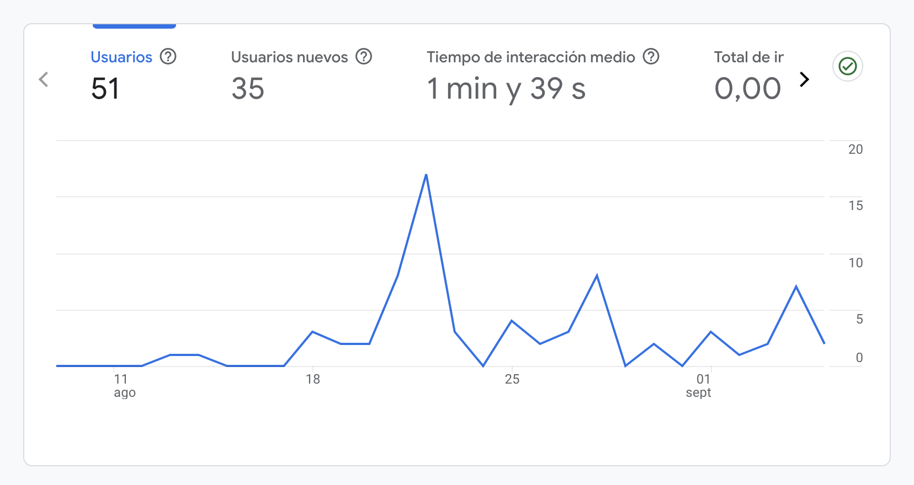
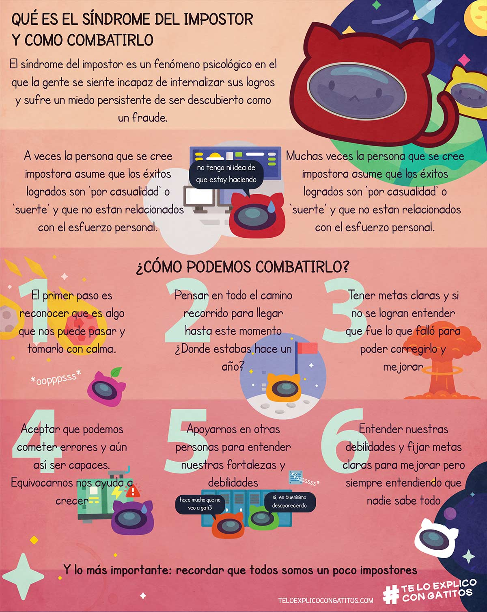
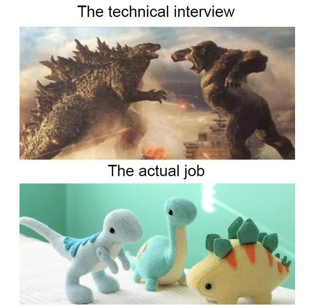

# Technical Interviews

## Table of contents

1. [Introduction](#introduction)
1. [Types of interviews](#types-of-interviews)
   1. [Examples](#examples)
1. [Advices](#advices)
   1. [Impostor syndrome](#impostor-syndrome)
1. [Resources](#resources)
   1. [Job offers](#job-offers)
   1. [Katas & technical interviews](#katas--technical-interviews)
   1. [News](#news)
   1. [What technology to learn](#what-technology-to-learn)
1. [Articles of interest](#articles-of-interest)
1. [Honorable mentions](#honorable-mentions)

## Introduction

El siguiente contenido pretende mostrar a coders los diferentes **tipos de pruebas técnicas** que podemos encontrar en un proceso de selección y consejos enfrentar cada una de ellas según la experiencia de nuestros formadores.

Las pruebas técnicas son un recurso habitual durante los procesos de selección en empresas y proyectos TEC. Su importancia es fundamental para conocer en el mayor detalle posible las habilidades técnicas de los futuros trabajadores y evitar la deuda técnica en los proyectos.

Sigue leyendo para descubir documentación, portales de ofertas, prácticas, noticias, tipos de pruebas y consejos para enfrentar la incertidumbre y afrontar el síndrome del impostor.

## Types of interviews

- Informal talk

- Live coding

- New project

- Pet project

- Code review

### Examples

- [Prueba técnica de maquetación](https://jorgebenitezlopez.com/pruebas/maquetacion-atsistemas.pdf): a realizar en dos horas. Valoran uso de html5, SASS, flex, grid, BEN y que hagas lo máximo

- [Prueba técnica de front (React)](https://jorgebenitezlopez.com/pruebas/front-blink.pdf): A realizar en una semana. Valoran uso de Redux

- [Prueba técnica de front (React)](https://jorgebenitezlopez.com/pruebas/front-zara.pdf): A realizar en una semana. Dispones aquí el [material](https://jorgebenitezlopez.com/pruebas/materialpruebadezara.zip)

- [Prueba técnica de Back (Symfony)](https://jorgebenitezlopez.com/pruebas/back-mio.pdf): A realizar en una semana

- [Prueba de React viendo código](https://github.com/MAD-DW-TI-P2/react-challenge). Te hacen preguntas en vivo sobre qué problema tiene el code

- [Ejemplo de prueba técnica real](https://github.com/amargopastor/chartJS)

## Advices

- Lee atentamente la **oferta laboral** a la que pretendes postular: asegúrate que esta encaja con tu plan de carrera. **Siempre valoran el compromiso y la personalización**.

- Las preguntas suelen relacionarse con estructuras de datos y algoritmos. [Estructuras de datos y algoritmos](https://www.geeksforgeeks.org/learn-data-structures-and-algorithms-dsa-tutorial/) | [Patrones de diseño](https://refactoring.guru/design-patterns/catalog)

- Investiga la empresa, el sector y, si es posible, los perfiles públicos de tus entrevistadores

- Importante tener una **maquetas y componentes a disposición**. Mejor si tienes un proyecto propio en producción (**tu PET**). Además tu PET te permite hackear la experiencia 

- Hablando de PET, asegúrate que tu **proyecto personal está actualizado, documentado y desplegado**

- **Cuida la UI en los proyectos que desarrolles**: Las personas procesan primero lo que ven antes de pensar. Inspírate en diseños que ya funcionan. Opta por un enfoque minimalista, ya que suele ser más efectivo

- No olvides practicar tus **soft skills**. Sobre todo una: La proactividad / la mentalidad de crecimiento

- **Pregunta todo** lo que puedas antes, durante y después de la entrevista. Siempre es grato un sano interés por las tecnologías, entornos, herramientas, metodologías y plan de carrera. Es importante mostrar interés y puedes sacar pistas para los siguientes pasos

- **Cuida muchos las formas y los detalles**: Nunca tendrás una segunda oportunidad para causar una buena primera impresión. Sé puntual, vístete adecuadamente, recoge y ordena tu espacio, verifica la iluminación del lugar y asegúrate de tener una buena conexión. Haz pruebas previas para que todo funcione correctamente

- Muchas veces te ponen **problemas imposibles** a ver cómo piensas, cómo te ordenas y cómo gestionas el estrés. Por ejemplo: '¿Cuánto dinero costaría limpiar todas las ventanas de Seatle?'. También suelen pedir más de lo posible para ver cómo se gestiona el estrés

- **Sé sincer@** con los aspectos que dominas y aún más con aquellos que no dominas (se nota mucho cuando haces una pregunta y se pone a buscarla en internet...). Aunque la tecnología avanza...

  

- **Lo importante es entrar**: una vez dentro y con algo de experiencia es más fácil crecer. Son muchos los casos de personas que entraron en el departamento de marketing que hicieron una app y terminaron en el departamento de IT

- Los procesos de selección son una **carrera de fondo**: asegúrate de [llevar un registro](https://www.notion.so/templates/category/job-application-tracking) de todo tu trabajo

- Utiliza **estrategias de marketing digital** para medir tu impacto: trazabilidad, hacer test A/B de cvs, etc. Añade [Google Analytcis](https://analytics.google.com/analytics/web/?authuser=0#/provision/create) a tu web/portfolio/cv online o guarda en el log las url con los tags y cuando envíes el CV añadelé [UTM](https://support.google.com/analytics/answer/10917952?sjid=5735640810721447324-EU#cc-set-up&zippy=%2Csecciones-de-este-art%C3%ADculo) para saber quién visita por portfolio.

  

### Impostor syndrome

  

Por eso trabajamos la pedagogía activa...

## Resources

### Job offers

- [Remoteok](https://remoteok.com/): Se trata de una portal online de búsqueda de empleo especializado en ofertas de teletrabajo.

- [Y Combinator startups](https://www.workatastartup.com/jobs): Página especializada en encontrar puestos vacantes y conectar fundadores y equipos de contratación de más de 1000 nuevas empresas de Y Combinator. Puedes ver más información acerca de [cómo funciona en esta página](https://www.workatastartup.com/about).

- [Joppy](https://app.joppy.me/): Joppy es una startup formada por programadores para programadores.

- [Upwork](https://www.upwork.com/): Upwork es una plataforma que conecta freelancers con clientes en todo el mundo. Ofrece una amplia gama de trabajos para profesionales independientes, desde desarrollo web hasta redacción de contenidos y diseño gráfico.

- [Toptal](https://www.toptal.com/): Toptal es una red formada por desarrolladores de software, diseñadores, expertos en marketing, expertos en finanzas, gerentes de productos y gerentes de proyectos independientes del mundo. Las empresas pueden contratar freelancers de Toptal para sus proyectos.

- [Indeed](https://es.indeed.com/): Es la página web de empleo #1 en el mundo con más de 350 millones de usuarios mensuales

- [Tecnoempleo](https://www.tecnoempleo.com/): Portal de empleo especializado en informática y telecomunicaciones

- [Arc](https://arc.dev/): Se trata de una portal online de búsqueda de empleo especializado en ofertas de teletrabajo.

- [Jobspresso](https://jobspresso.co): Se trata de una portal online de búsqueda de empleo especializado en ofertas de teletrabajo.

- [Fiverr](https://es.fiverr.com/): Trabajos freelance

### Katas & technical interviews

- [Codewars](https://www.codewars.com/): Codewars es una plataforma que te ayuda a aprender, entrenar y mejorar tus habilidades de programad@r resolviendo ejercicios de código de muchos tipos y niveles de dificultad.

- [Hackerrank](https://www.hackerrank.com/): En esta página podemos realizar un sencillo cuestionario inicial obtener nuestro plan de carrera en cualquiera de las siguientes [opciones disponibles](https://www.hackerrank.com/skills-directory).

- [Warmup](https://grow.google/certificates/interview-warmup/): Una plataforma web dónde podemos ensallar nuestras entrevistas y recibir feedback inmediato. Se acompaña además de una plataforma con multitud de recursos (texto y vídeo) para preparar estas mismas pruebas.

- [Hellointerview](https://www.hellointerview.com/learn/code): Una guía visual de los patrones y enfoques más importantes para la entrevista de codificación.

  

### News

- [Ycombinator](https://news.ycombinator.com/)

- [Github.com/trending](https://github.com/trending)

- [Stackoverflow](https://stackoverflow.blog/)

- [Portswigger](https://portswigger.net/daily-swig)

- [Dev.to](https://dev.to/t/news)

- [2020.stateofjs](https://2020.stateofjs.com/en-US/)

  
Otras fuentes de noticias del mundo tec:

- [Crunchbase](https://www.crunchbase.com/): Crunchbase es una empresa que proporciona información sobre distintas empresas del sector. Su contenido incluye información sobre inversiones y financiación, personas en puestos de liderazgo y noticias corporativas.

- [Packtpub](https://www.packtpub.com/free-learning): Packt es un proveedor global de contenidos de aprendizaje técnico.

- [Goalkicker](https://goalkicker.com/): Libros de notas de programación para profesionales

- [Top Products Launching Today](https://www.producthunt.com/)

- [Microsiervos](https://www.microsiervos.com/)

- [Hackernoon](https://hackernoon.com/)

- [Techcrunch](https://techcrunch.com/)

- [X-team](https://x-team.com/blog)

- [Engineering.atspotify](https://engineering.atspotify.com/)

- [Research.netflix](https://research.netflix.com/)

- [Disneyresearch](https://la.disneyresearch.com/publication/)

- [Anandtech](https://www.anandtech.com/)

- [Hackaday](https://hackaday.com/)

- [Applesfera](https://www.applesfera.com/)

- [Hacks.mozilla](https://hacks.mozilla.org/)

- [Informationisbeautiful](https://informationisbeautiful.net/beautifulnews/)

- [Uber.com](https://www.uber.com/es-ES/blog/madrid/engineering/)

- [Zalando](https://engineering.zalando.com/)

### What technology to learn

- [Developer Roadmaps](https://roadmap.sh/): roadmap.sh es un esfuerzo comunitario para crear hojas de ruta, guías y otro contenido educativo para ayudar a los desarrolladores a elegir un camino y guiar sus aprendizajes.

- [Mapa del empleo de Telefónica](https://mapadelempleo.fundaciontelefonica.com/): el Mapa del Empleo es una herramienta interactiva que, gracias a las tecnologías de Inteligencia Artificial y Big Data, analiza la oferta laboral en España y muestra las profesiones y habilidades digitales más demandadas, así como su evolución en el tiempo.

- [Stackoverflow survey](https://survey.stackoverflow.co/2024/#overview): En mayo de 2024, más de 65,000 desarrolladores respondieron a nuestra encuesta anual sobre programación y tecnologías y herramientas que utilizan y quieren aprender.

- [Project Based Learning](https://github.com/practical-tutorials/project-based-learning): Una lista de tutoriales de programación en los que los aspirantes a desarrolladores de software aprenden a crear una aplicación desde cero. Estos tutoriales se dividen en diferentes lenguajes de programación principales. Los tutoriales pueden involucrar múltiples tecnologías e idiomas.

- [Build your own X](https://github.com/codecrafters-io/build-your-own-x): Este repositorio es una recopilación de guías paso a paso bien escritas para recrear nuestras tecnologías favoritas desde cero.

- [Coding Interview University](https://github.com/jwasham/coding-interview-university): Plan de estudios de varios meses para pasar de ser un Desarrollador Web (Autodidacta, sin título) a un Ingeniero de Software para una gran compañía.

- [Google ](https://github.com/jwasham/coding-interview-university): Plan de estudios de varios meses para pasar de ser un Desarrollador Web (Autodidacta, sin título) a un Ingeniero de Software para una gran compañía.

- [Company wise problems 2002](https://github.com/hxu296/leetcode-company-wise-problems-2022): Listas seleccionadas de preguntas de Leetcode agrupadas por empresas (mayo de 2022).

- [Google Trends](https://trends.google.com/trends/explore?date=all&q=%2Fm%2F07sbkfb,%2Fm%2F05z1_,%2Fm%2F02p97&hl=es): Proporciona acceso a una muestra (sin filtros, la mayor parte) de solicitudes de búsqueda reales realizadas a Google. Es anónima, se organiza en categorías (según el tema de las consultas de búsqueda) y contiene datos agregados.

  

## Articles of interest

- [10 Useful Tips To Successful Technical Writing](https://dev.to/drprime01/10-useful-tips-to-successful-technical-writing-4d65)

- [I'm An Impostor](https://dev.to/bytebodger/i-m-an-impostor-5f7f)

- [What everyone's getting wrong about bootcamps vs degrees](https://dev.to/heyjtk/what-everyones-getting-wrong-about-bootcamps-vs-degrees-521e)

## Honorable mentions

- [Sebastián Rotman](https://www.linkedin.com/in/sebasti%C3%A1n-rotman-saffie-b84341143/)

- [Jorge Benítez](https://www.linkedin.com/in/jorgebenitezlopez/)

- [Marcos Íñigo](https://www.linkedin.com/in/amargopastor/)

**[⬆ Back to top 🍍](#table-of-contents)**
